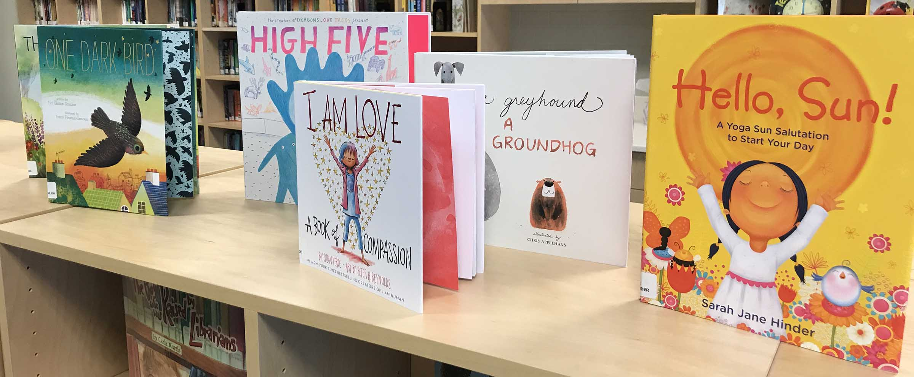
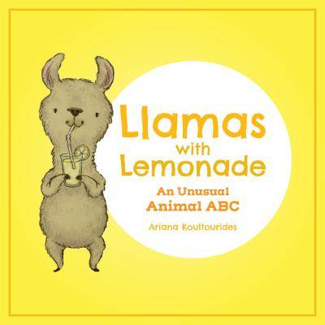
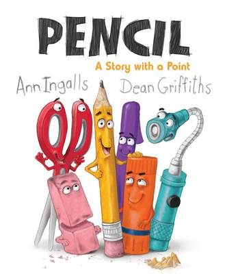
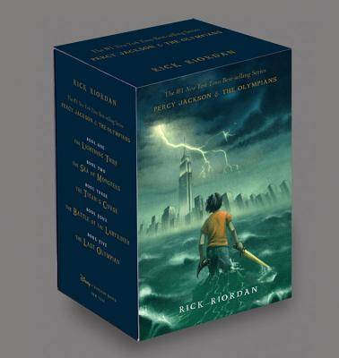
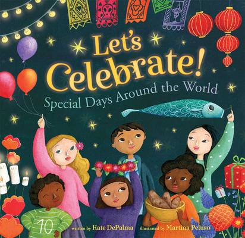

  

  
    

      <h1 class="display-1">WHMS Book Fair</h1>
      
This year we're partnering with The Open Door Book Store to bring the Book Fair online!

      

      
In the following pages you can see previews of the books we're looking at this year. And we'll talk about them, together! Join us on the pages separated by school level, activities, and reference. Our partners at Open Door have curated a list of amazing and popular books for us this year, and you can find them all, safely, here! Once you find them we have the links to buy them from Open Door, all to help promote reading AND raise money for new books for our school! This year proceeds will again be focused on purchasing books for the new library, so all classes can enjoy them.

      <h2>Community Discussions</h2>
      
Our procedure this year will be browse and discuss the books on this site, we welcome everyone to discuss the books with the Book Fair chairs and the librarian in the comments section! Featured books will be highlighted on the discussion page, but we have whole pages to browse for each level. And you can order anything from Open Door's site too.

      <h2>Ordering</h2>
      
Once you're ready to purchase, the pages here links directly to Open Door's website where you can put together your cart. Please write in the notes section that they are a part of the WHMS Book Fair, and then check out. You need to be sure to add the note, part of the WHMS Book Fair, to the cart so we can track your order, and deliver the order to school.

      
Please note that because of the pandemic possibly causing erratic disruptions in the production and delivery chains we can't guarantee delivery before the holidays. But we're doing everything we can, including holding the Book Fair early, to give us the best chance at quick order turn arounds.

      
We will be handing out deliveries of books at WHMS during carline as they become available. We'll have a spot at the turnaround on the way down from carline where we'll place your books in your car.

    

  

  

    

    
      

        <h5 class="card-title">Toddler &amp; Primary</h5>
        <a href="./toddler-primary.html" class="btn btn-lg btn-outline-primary stretched-link">View Toddler &amp; Primary Books</a>
      

    

  

  

    

    
      

        <h5 class="card-title">Lower Elementary</h5>
        <a href="./lowerel.html" class="btn btn-lg btn-outline-primary stretched-link">View Lower Elementary Books</a>
      

    

  

  

    

    
      

        <h5 class="card-title">Upper Elementary</h5>
        <a href="./upperel.html" class="btn btn-lg btn-outline-primary stretched-link">View Upper Elementary Books</a>
      

    

  

  

    

    
      

        <h5 class="card-title">Middle School</h5>
        <a href="./middleschool.html" class="btn btn-lg btn-outline-primary stretched-link">View Middle School Books</a>
      

    

  

  

    

    
      

        <h5 class="card-title">Activities &amp; Hobbies</h5>
        <a href="./middleschool.html" class="btn btn-lg btn-outline-primary stretched-link">View Activity &amp; Hobby Books</a>
      

    

  

  

    

    
      

        <h5 class="card-title">Research &amp; Science</h5>
        <a href="./middleschool.html" class="btn btn-lg btn-outline-primary stretched-link">View Research &amp; Science Books</a>
      

    

  

