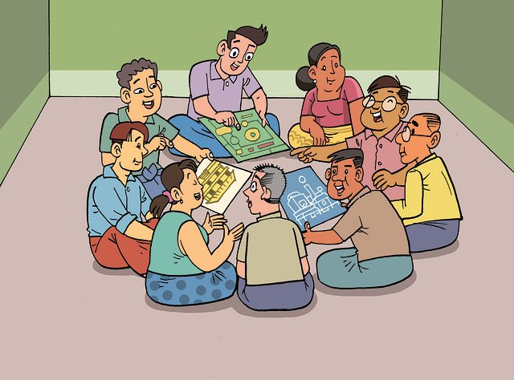

  

    

      <h1 class="display-1">{{ page.title }}</h1>
      <!-- 
This year we’re partnering with The Open Door Book Store to bring the Book Fair online!
 -->
      

      
Here are a selection of {{ page.title }} for students. [[INSERT MORE TEXT HERE]]

    

  

  

    

      

        

          
        

        

          

            <h5 class="card-title">Hop into our chat to ask questions and discuss age appropriate {{ page.title }}.</h5>
            <a class="stretched-link" href="./middleschool-discussion.html">Join the Discussion!</a>
          

        

      

    

  

  
