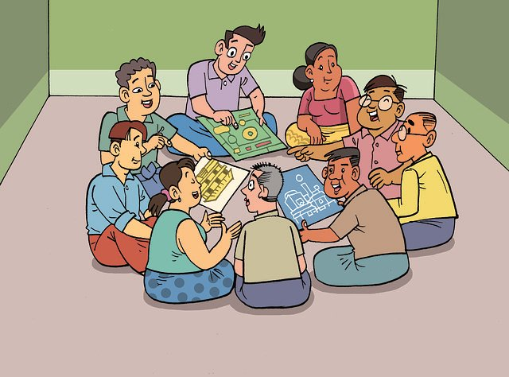

  

    

      <h1 class="display-1">{{ page.title }}</h1>
      

      
Here is our selection of Upper Elementary books for students. They include picture, fiction, chapter books, reference, and hobby books. There are more activity and hobby books on the <a href="./activity-hobby.html">Activities and Hobbies page</a> that may be of interest. And more reference and science books on the <a href="./reference-science.html">Reference and Science page</a>, which may be of interest, too.

    

  

  

    

      

        

          
        

        

          

            <h5 class="card-title">Hop into our chat to ask questions and discuss age appropriate {{ page.title }}.</h5>
            <a class="stretched-link btn btn-lg btn-outline-primary mt-5 d-block" href="./upperel-discussion.html">
            <svg width="1em" height="1em" viewBox="0 0 16 16" class="bi bi-chat-left-dots" fill="currentColor" xmlns="http://www.w3.org/2000/svg">
              <path fill-rule="evenodd" d="M14 1H2a1 1 0 0 0-1 1v11.586l2-2A2 2 0 0 1 4.414 11H14a1 1 0 0 0 1-1V2a1 1 0 0 0-1-1zM2 0a2 2 0 0 0-2 2v12.793a.5.5 0 0 0 .854.353l2.853-2.853A1 1 0 0 1 4.414 12H14a2 2 0 0 0 2-2V2a2 2 0 0 0-2-2H2z"/>
              <path d="M5 6a1 1 0 1 1-2 0 1 1 0 0 1 2 0zm4 0a1 1 0 1 1-2 0 1 1 0 0 1 2 0zm4 0a1 1 0 1 1-2 0 1 1 0 0 1 2 0z"/>
            </svg>
            Join the Discussion!</a>            
          

        

      

    

  

  
